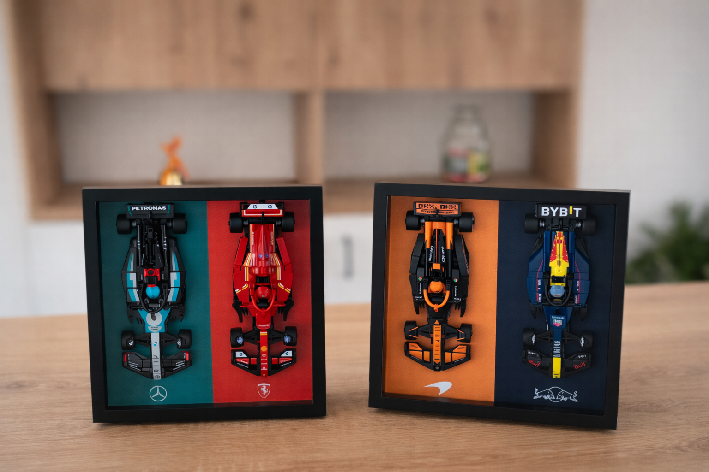

# 🏎️ LEGO F1 IKEA Frame Generator

A fan-made web app for generating print-ready PDF backgrounds for **LEGO F1 Speed Champions** sets displayed in **IKEA SANNAHED frames**.

  

---

## 🌐 Web App

👉 **[alienpixl.github.io/lego-f1-ikea-frame-generator](https://alienpixl.github.io/lego-f1-ikea-frame-generator)**

---

## 📖 Documentation

See the [Wiki](../../wiki) for detailed instructions:
- [Available Teams](../../wiki/Available-Teams)
- [How to Use](../../wiki/How-to-Use)
- [Print & Assembly Instructions](../../wiki/Print-and-Assembly)
- [Submit a Design](../../wiki/Submit-a-Design)

---

## ⚠️ Disclaimer

This is an **unofficial fan-made project** created for personal and non-commercial use only.

- All F1 team names, logos, and trademarks are the property of their respective owners
- LEGO® is a trademark of the LEGO Group
- IKEA® and SANNAHED™ are trademarks of Inter IKEA Systems B.V.
- Formula 1®, F1®, and related marks are trademarks of Formula One Licensing B.V.

This project is **not affiliated with, endorsed by, or connected to** Formula 1, any F1 team, the LEGO Group, or IKEA. It may **not be sold or used for commercial purposes**.

---

## 📄 License

See the [LICENSE](LICENSE) file for details.

---

## 📝 Changelog

See the [CHANGELOG](CHANGELOG.md) file for version history.